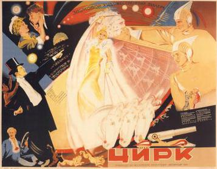

## Early Soviet Films

<section>

The Soviet films best known to Westerners are from the early Soviet period.
Those made before 1932 are often innovative, often avant-guard. Between 1932
and 1955 the government required that films by in a style known as Socialist
Realism. This meant that they had to have clear storytelling, characters worthy
of imitation, and they had to promote Soviet values.  This often meant made
the films dull and formulaic, but a films of this period rose above these
limitations to become classics.

</section>

<section>
<h3>Well-Known Early Soviet Films (1917--1955)</h3>
<ul>
<li><h4>Аэлита (1924)</h4>
	 
	<i>Aelita Queen of Mars</i>
	 
	FIXME: no description
	</li>
<li><a href="https://www.youtube.com/watch?v=bq1Qx6jOJ0A">
	<h4>Необычайные приключения мистера Веста в стране большевиков (1924)</h4></a>
	 
	<i>The Extraordinary Adventures of Mr. West in the Land of the Bolsheviks</i>
	 
	FIXME: no description
	</li>
<li><a href="https://www.youtube.com/watch?v=aiU8c1mjJSA">
	<h4>Броннносец «Потёмкин» (1925)</h4></a>
	 
	<i>Battleship Potemkin</i>
	 
	Dramatization of the 1905 mutiny on the battleship Potemkin over an attempt to feed
	the crew wormy meat. Directed by Sergei Eisenstein whose work is of great interest
	to students of film. 
	</li>
<li><a href="https://www.youtube.com/watch?v=3C-2RgK3WwA">
	<h4>Человек с киноапаратом (1929)</h4></a>
	 
	<i>The Man With the Movie Camera</i>
	 
	FIXME: no description
	</li>
<li><a href="https://www.youtube.com/watch?v=u1QbXeZEnPc">
	<h4>Земля (1930)</h4></a>
	 
	Earth
	 
	FIXME: no description
	</li>
<li><a href="https://www.youtube.com/watch?v=AmjJ7YaSpYc">
	<h4>Чапаев (1934)</h4></a>
	 
	<i>Chapaev</i>
	 
	This war movie was one of the most popular films of the early Soviet period.
	It is about a Red Army commander who battles heroicly for the revolutionary cause.
	Though clearly propagandistic, it nonetheless was well received, reportedly because
	of the way it humanized the hero.
	</li>
<li><a href="https://www.youtube.com/watch?v=chDRXQ77IgA">
	<h4>Весёлые ребята (1934)</h4></a>
	 
	<i>Jolly Fellows</i>
	 
	Yelena, a flirty student from a school for upper-class girls is attracted to 
	a young man named Kostya who plays the flute and sings. Though he is a humble
	shepherd, she has mistaken him for a famous orchestra conductor. Meanwhile,
	Yelena's maidservant (Lyubov Orlova) has noticed him too and is attracted to
	him. Yelena invites him to the school where further misunderstandings and
	hilarity follow.
	</li>
<li>
	<figure class="right_edge">
	  
	  <figcaption>Цирк (1934)</figcaption>
	</figure>
	<a href="https://www.youtube.com/watch?v=ia4DyErYhAs">
	<h4>Цирк (1936)</h4></a>
	 
	<i>Circus</i>
	 
	FIXME: no description
	</li>
<li><a href="https://www.youtube.com/watch?v=37VKMbMHjt0">
	<h4>Волга, Волга (1938)</h4></a> or <a href="https://www.youtube.com/watch?v=lHjlL_0lpxo">Colorized in HD</a>
	 
	<i>Volga, Volga</i>
	 
	A delegation from a village travels on the Volga river to Moscow to participate in a talent show.
	Among the group is a female letter carrier (Lyubov Orlova) who has written a catchy song called
	<i>Volga, Volga</i>.
	</li>
<li><a href="https://www.youtube.com/watch?v=iRpO0vhG8f8">
	<h4>Александр Невский (1938)</h4></a>
	 
	<i>Aleksandr Nevskiy</i>
	 
	Depicts the defeat of the Teutonic Knights by Prince Alexander in the 13th
	century when they attempted to invade Novgorod. Directed by Sergei
	Eisenstein. The acting, costumes, and action are deliberately stylized
	as if this were an opera. Very highly regarded for its style and skilful
	use of moving pictures to tell a story.
</li>
<li><a href="https://www.youtube.com/watch?v=igq6Is867Rw">
	<h4>Иван Грозный (1944)</h4></a>
	 
	<i>Ivan the Terrible</i>
	 
	Another masterpiece by Sergei Eisenstein. Depicts the first part of the reign
	of Russian king Ivan IV "the Terrible" (or in modern English, "the Formidable").
	</li>
<li><a href="https://www.youtube.com/watch?v=yl3njkwk-dw">
	<h4>Небесный тихоход (1945)</h4></a> (Link is to the 2012 colorized version)
	 
	<i>Heavenly Slug</i> (probably should be <i>The Sky Slug</i>)
	 
	In this lighthearted war comedy four buddies vow not to fall in love until
	World War II is over. But their resolution starts to falter when they
	a squadron of female aviators and a pretty journalist show up.
	</li>
<li><a href="https://www.youtube.com/watch?v=kuTP9NZuEDw">
	<h4>Весна (1947)</h4></a>
	 
	<i>Spring</i>
	 
	A female scientist (Lyubov Orlova) obsessed with her research in the area of solar energy
	broadens out when she is asked to participate in a film called Lady Scientist.
	</li>
<li><a href="https://www.youtube.com/watch?v=28FMX-ZVYrI">
	<h4>Укротительница тигров (1954)</h4></a>
	 
	<i>Lady Tiger Tamer</i>
	 
	A girl from a circus family (Lyudmila Kasatkina) achieves her dream of
	becoming a lion tamer.
	</li>
<li><a href="https://www.youtube.com/watch?v=r_-sU1smWDY">
	<h4>Мать (1955)</h4></a>
	 
	Mother
	 
	FIXME: no description
	</li>
</ul>
</section>
